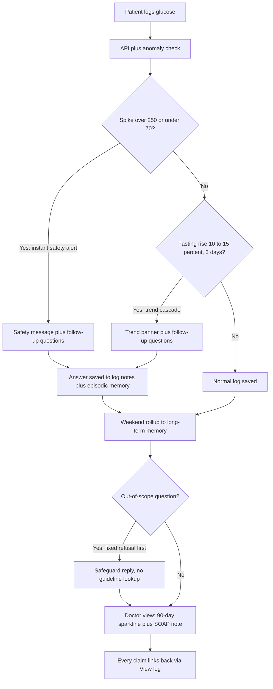
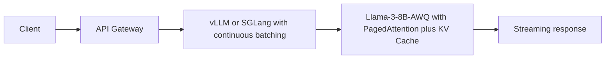

# Diabetes Companion - Turning Silent Blood-Sugar Gaps Into Action

An AI assistant that helps people with diabetes stay on track between doctor visits - and gives doctors a 10-second pre-visit brief they can trust.

- **Watch the demo (0 setup):** [demo video](docs/demo/demo.webm) (~1 min, PC1→PC4, Playwright robot draft)
  (recording script: [docs/demo/script.md](docs/demo/script.md); robot draft: `frontend/e2e/demo_recorder.spec.ts`)
- **Jump to the story:** [2. What I built](#2-what-i-built--two-stories) - [3. Watch the 3-step demo](#3-live-demo--watch-first-run-if-youre-technical)

<!--
  Screenshot placeholders (uncomment when assets land - do NOT use live ![] to missing files):
  - docs/demo/tracker-anomaly.png - patient tracker with anomaly banner + follow-up questions
  - docs/demo/previsit-soap.png - doctor pre-visit view: 90-day sparkline + SOAP note
  - Video: replace the TODO link above with the real recording
-->

---

## 1. The problem - 7 million people, blind for 3 months at a time

In Vietnam, **7.3% of adults (about 7 million people)** live with diabetes. Over **60% are undiagnosed**, and even diagnosed patients on medication (76-83% adherent) **self-monitor at home only 20.2% of the time** (Thanh Nhan Hospital, type 2 + kidney complication, n=104). The standard HbA1c check happens every 3 months - so patients are effectively **blind to their own glucose trends for months** between visits.

**Why this can be a business (3 lines):**
- **People already pay:** the FreeStyle Libre sensor (14-day, no finger prick) sells at **2-4M VND/kit** - monitoring demand is proven out-of-pocket.
- **Policy tailwind:** national health insurance (BHYT) **reimburses telehealth from 1 July 2025**, and Vietnam has only **14 doctors per 10,000 people** - doctor time is scarce, so AI triage has real value.
- **Go-to-market:** B2B2C - sell the doctor summary tool to **clinics**, not a subscription to patients (pure-software B2C payment is unproven).

---

## 2. What I built - two stories

**Story 1 - Patient side: from a scary number to a calm next step.**
You log a reading (e.g. 260 mg/dL). Instead of silence, you get an anomaly banner plus Follow-up Questions (FQG - short clarifying questions that gather context before any escalation, e.g. "did you eat sweets last night / miss medication?"). Dangerous lows (below 70) and critical highs (300 and above) always trigger an immediate safety message first.

**Story 2 - Doctor side: 3-5 minutes of prep in 10 seconds.**
The pre-visit view is 30% chart + 70% text: a **90-day sparkline** with red dots on anomalies, plus a SOAP note (SOAP - the standard doctor note format: Subjective / Objective / Assessment / Plan). Every claim carries a **[View log #id]** link that jumps back to the raw log. The Plan section is **intentionally left empty** - "for the doctor to decide". Doctors also get a smart patient queue at `/expert/patients` (triage-sorted: critical spike first, then trend cascade, safe last). The tracker architecture is modular for multi-metric expansion (BP/HR/SpO2), but this MVP focuses deeply on glucose as a proof of concept.

<!--
  TODO assets:
  - docs/demo/tracker-anomaly.png (Story 1)
  - docs/demo/previsit-soap.png (Story 2)
-->

---

## 3. Live demo - watch first, run if you're technical

### A. Watch (for everyone - 0 setup)

**3-click scenario (under 2 minutes):**
1. **Log a high reading** (e.g. 260 mg/dL) in the tracker - see the anomaly banner + follow-up questions.
2. **Open the pre-visit page** - see the 90-day sparkline with red dots.
3. **Read the SOAP note** - check the Assessment ("meets / does not meet HbA1c <7% target"), confirm the Plan is empty and greyed out, click a **[View log #id]** link to verify the source.

Video demo: [docs/demo/demo.webm](docs/demo/demo.webm) (~1 min, PC1→PC4). Full lời thoại + checklist quay: [docs/demo/script.md](docs/demo/script.md).

### B. Run (for developers - collapsed)

<details>
<summary><strong>Run the local demo in about 5 minutes</strong></summary>

Backend (FastAPI):

```bash
pip install -e .
# alternative: pip install -r requirements.txt  (same openai-only base)
# local embeddings/reranker: pip install .[local]
# .env needs: OPENAI_API_KEY=sk-proj-... (demo runs on gpt-4o-mini, no GPU needed)
uvicorn src.api.main:app --reload --port 8000
```

Frontend (Next.js):

```bash
cd frontend && npm install && npm run dev  # http://localhost:3000
# .env.local needs: NEXT_PUBLIC_API_URL=http://localhost:8000
```

Try it:

```bash
curl -X POST http://localhost:8000/v1/glucose \
  -H "Content-Type: application/json" \
  -d '{"user_id":"demo","value_mgdl":260,"context":"fasting"}'
```

Full setup, indexing, and test commands are in the [Tech snapshot](#6-tech-snapshot-for-developers) and existing docs (`docs/architecture_diagram.md`, `docs/api_contract.md`).

</details>

---

## 4. Safety by design - why an employer can trust this with health data

- **Hard safety thresholds, always on:** low below 70, critical 300+, fasting high 126+, post-meal high 200+ mg/dL. Spikes above 250 / below 70 always warn before anything else.
- **Out-of-scope questions get a fixed refusal - before any medical lookup:** e.g. "which antibiotics should I take?" returns exactly: *"This system is designed only for blood-sugar tracking. [Topic] is outside its safe scope. Please ask your doctor at your next visit."* The RAG lookup (RAG - Retrieval-Augmented Generation: answers grounded in WHO/Ministry-of-Health guidelines with citations) is never called for these.
- **Assessment is narrow and honest:** it only states whether readings align with the **HbA1c <7% target** per Vietnam's QD 5481/QD-BYT 2020 (Type 2 diabetes) + ADA Standards of Care 2024. Note: QD 3192 covers **hypertension, not diabetes** - it is never used for diabetes assessment. The system never makes a new diagnosis.
- **Plan stays empty + every claim is auditable:** the Plan section returns empty with a greyed-out "for the doctor to decide" placeholder, and every Subjective/Objective/Assessment line carries a **[View log #id]** link to the raw entry.
- **Fails safe:** if the anomaly check crashes, the glucose log itself still saves (anomaly = none) - the safety layer can never break core data.

> **Disclaimer:** technical demo only. All AI output is supportive information, not a diagnosis or treatment. Safety thresholds applied; consult a doctor for medical decisions.

---

## 5. How it works - risk-routed flow



- **RAG** (Retrieval-Augmented Generation) = answers grounded in WHO/Ministry-of-Health guidelines with citations, so nothing is invented.
- **FQG** (Follow-up Questions) = short clarifying questions that gather context (food, medication) before escalating to a doctor; full multi-turn conversation is future work.
- **SOAP** (Subjective / Objective / Assessment / Plan) = the standard doctor note format; here Assessment covers only the HbA1c target and Plan stays empty.
- Memory reuses the existing 3-layer store; each weekend, episodic notes roll up into **one fact per week** (e.g. "week of Mar 3: frequent late-night sweets").

---

## 6. Tech snapshot (for developers)

| Layer | Choice |
|---|---|
| Backend | FastAPI (`POST /v1/glucose`, `/v1/query`, `/v1/soap/generate`) |
| Frontend | Next.js 14 + Recharts (90-day sparkline) |
| Knowledge | Chroma + OpenAI `text-embedding-3-small`; WHO + ADA 2024 + BYT QD 5481 |
| AI (demo) | `gpt-4o-mini` via API - no GPU needed |
| Quality | **45 pytest pass** (`test_anomaly_detector` + `test_soap_summary` + `test_api_diabetes` + `test_glucose_tracker`), `tsc --noEmit` 0 errors, RAGAS faithfulness scoring on retrieved contexts |

<details>
<summary><strong>Tests and quality signals (full)</strong></summary>

```bash
pip install -e .[test]
pytest tests/test_anomaly_detector.py tests/test_soap_summary.py tests/test_api_diabetes.py tests/test_glucose_tracker.py -v  # 45 passed
cd frontend && npx tsc --noEmit  # 0 errors
```

- RAGAS faithfulness is scored on retrieved guideline contexts (memory rows are filtered out of the evaluator so they cannot inflate the score).
- E2E note: older Playwright specs predate the current auth UI and fail on `User ID` selectors - unrelated to this demo; manual UI recording is the source of truth.

</details>

Existing docs: `docs/architecture_diagram.md` - `docs/api_contract.md` - `docs/evaluation.md` - `docs/data_contract.md` - `docs/monitoring.md`

---

## 7. Production path - FUTURE, NOT IN DEMO

> **FUTURE - NOT IN DEMO.** The demo above runs on `gpt-4o-mini` via API. Nothing below is implemented; no GPU dependency is in the demo install.

Planned production serving: **Llama-3-8B-AWQ** (AWQ - Activation-aware Weight Quantization: a compressed model format that runs faster on less GPU memory) + **vLLM/SGLang** with **PagedAttention** (memory-efficient attention for serving) and **continuous batching** (serving many requests together) to cut time-to-first-token for multi-turn follow-up questions. Benchmarks on hosted GPUs are future work - no numbers are claimed here.



Also future: full multi-turn FQG, LLM intent classifier (replacing the current keyword gate), direct HbA1c lab import.

---

## References and contact

- VTV - over 60% undiagnosed: https://suckhoe.vtv.vn/suc-khoe/ty-le-nguoi-mac-dai-thao-duong-chua-duoc-chan-doan-tai-viet-nam-hien-tai-la-hon-60-20241109143256325.htm
- Tuoi Tre - about 7M people with diabetes: https://tuoitre.vn/khoang-7-trieu-nguoi-viet-dang-mac-dai-thao-duong-20240701080303435.htm
- BYT QD 5481/QD-BYT 2020 (Type 2 diabetes guideline): https://thuvienphapluat.vn/van-ban/The-thao-Y-te/Quyet-dinh-5481-QD-BYT-2020-tai-lieu-chuyen-mon-Huong-dan-chan-doan-dieu-tri-dai-thao-duong-tip-2-460925.aspx
- ADA Standards of Care in Diabetes 2024: https://diabetesjournals.org/care/issue/47/Supplement_1
- WHO GHO diabetes data: https://www.who.int/data/gho/data/indicators/indicator-details/GHO/prevalence-of-diabetes-age-standardized
- BHYT telehealth reimbursement from 1/7/2025 + doctor-density stats: see prior README history (`git log -- README.md`, 553-line version)

**Contact / next steps:** *TODO: your name, email, LinkedIn, and what you are looking for (internship / junior role / collaboration).*
