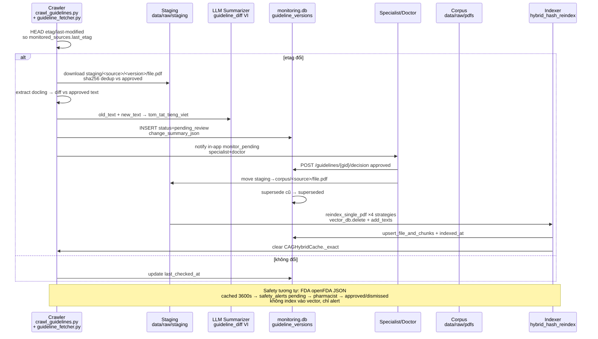
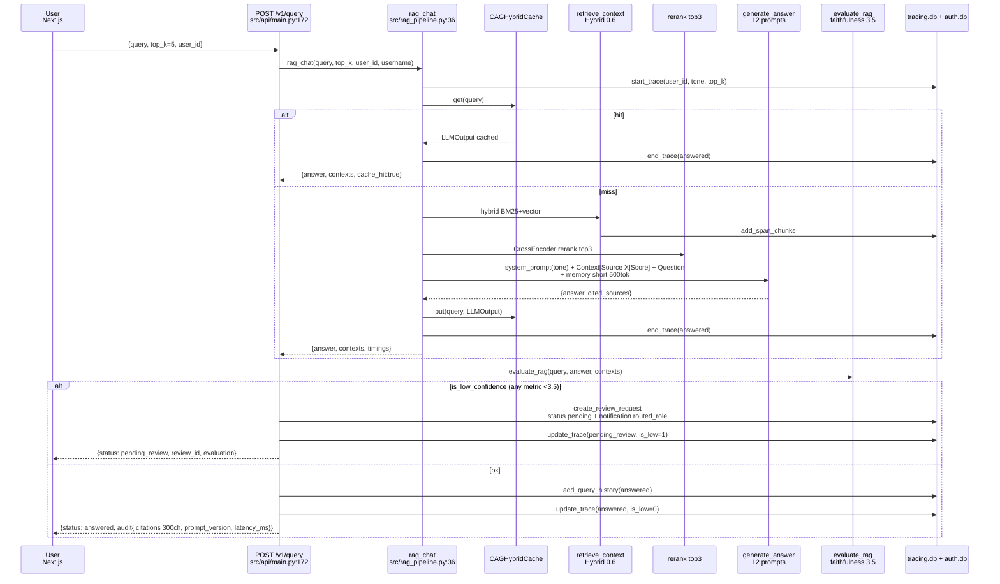
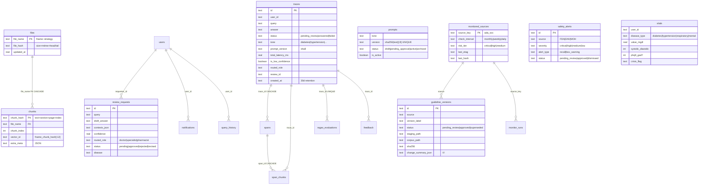

# Sơ Đồ Kiến Trúc — WHO-RAG System

> 4 sơ đồ Mermaid + bảng ràng buộc. Nguồn: `src/config.py`, `src/rag_pipeline.py:36`, `src/observability/tracing_db.py:32`, `src/indexer.py:98`, `src/monitors/*`, `frontend/app/**`.

## 1. Tổng quan hệ thống

```mermaid
graph TB
  subgraph Client
    NextJS[Next.js 14 App Router<br/>frontend/app]
    Playwright[E2E Playwright]
  end
  subgraph API["FastAPI - WHO-RAG Infrastructure API<br/>src/api/main.py:102"]
    Health[GET /health<br/>pdf_count + vector_ready]
    Query[POST /v1/query<br/>HILT + Audit]
    Vitals[POST/GET /v1/glucose|bp|respiratory|mood|vitals]
    SOAP[POST /v1/soap/generate]
    Auth[POST /v1/auth/*]
    Reviews[GET/POST /v1/reviews]
    Monitors[POST/GET /v1/monitors/*]
    Admin[GET/POST /v1/admin/traces|prompts]
  end
  subgraph RAG["RAG Pipeline v2<br/>src/rag_pipeline.py:36"]
    Cache[CAGHybridCache<br/>exact + semantic FAISS 0.82<br/>src/cache.py]
    Retriever[Hybrid Retriever<br/>BM25 + Vector 0.6<br/>src/retriever.py]
    Rerank[CrossEncoder<br/>ms-marco-MiniLM-L-6-v2]
    Generator[LLM Generator<br/>OpenAI/Groq + 12 prompts]
    Memory[Memory<br/>short 500tok + episodic 300tok<br/>+ long-term 3 facts]
    Evaluator[LLM-as-judge<br/>faithfulness 3.5]
  end
  subgraph Storage
    PDFs[data/raw/pdfs<br/>34 PDFs 18+1+4+5+3+3]
    Staging[data/raw/staging<br/>pending_review]
    Chroma[(Chroma<br/>pdf_db 4x33-39MB<br/>pdf_db_openai 1.7MB)]
    Meta[(metadata_store.db<br/>files 75, chunks 11428)]
    AuthDB[(auth.db<br/>users/reviews/notifications)]
    Tracing[(tracing.db<br/>traces/spans/chunks<br/>prompts/ragas)]
    MonitorDB[(monitoring.db<br/>10 sources)]
    VitalsDB[(vitals.db)]
  end
  subgraph Agents["Monitors Scheduler<br/>src/monitors/scheduler.py"]
    FDA[FDA daily 02:00<br/>api.fda.gov 240/min]
    BYT[BYT weekly Mon 03:00<br/>thuvienphapluat.vn]
    Guideline[Guideline monthly HEAD<br/>+ quarterly deep]
  end

  NextJS -->|authFetch 401 refresh| API
  Query --> RAG
  RAG --> Cache
  Cache -->|miss| Retriever
  Retriever --> Chroma
  Retriever --> Meta
  Rerank --> Generator
  Generator --> Evaluator
  Evaluator -->|low confidence| Reviews
  API --> Storage
  Agents --> Staging
  Staging -->|approve| PDFs
  PDFs -->|indexer 4 strategies| Chroma
```

**Điểm nhấn:**
- 4 chiến lược chunk `structure/sliding/semantic/hybrid` mỗi thứ 1 DB riêng, tách `pdf_db` (384d) vs `pdf_db_openai` (1536d) để tránh mismatch.
- HILT: `evaluate_rag` ngưỡng `3.5/5` trên 4 metrics, fail → `routed_role` (doctor/specialist/pharmacist) + `pending_review`.
- CAG 24h TTL, semantic threshold `0.82`, `max_size 1024` — cache hit bypass retrieval.

## 2. Luồng dữ liệu — Guideline & Safety (5 bước)



**Tầng an toàn:**
- SSRF allowlist 10 domains trước mọi `HEAD/GET`.
- `%PDF` magic + `<1KB` reject.
- Dedup `sha256` và `alert_url+title 7d`.

## 3. Sequence HILT — RAG Query



**Tone auto:**
`mental > hypertension > respiratory > diabetes > strict|friendly|balanced` theo keyword `src/generator.py:detect_tone_and_temp`.

**Spans:** `cache_check → retrieve_context → rerank_contexts → build_llm_input → generate_answer → cache_put → update_memories → format_answer` (7 spans, `duration_ms` tính từ `start_at`).

## 4. ERD — 6 DBs



**Retention & Index:**
- `tracing.db` `list_traces` enforce `created_at >= now-30d` + `delete_expired_traces`.
- `monitoring.db` `superseded` xóa sau `MONITOR_SUPERSEDED_RETENTION_DAYS=30`.

## 5. Gaps đã biết (cần xử lý trước prod)

| # | Gap | Ảnh hưởng | Mitigation trong doc |
|---|---|---|---|
| 1 | `scheduler` chưa wire vào FastAPI lifespan | Chỉ chạy sidecar, dev không có cron | Ghi trong `monitoring.md#Scheduling` + `dashboard_ui#Roadmap` |
| 2 | BYT scrape chưa test HTML thật | Có thể parse sai `snapshot.html` | Đã mock trong test, cần integration test với `thuvienphapluat.vn` thật |
| 3 | FDA `cached_get` chưa backoff 429 | Có thể miss critical recall | Thêm `time.sleep(0.25)` + TTL 1h, đề xuất exponential backoff |
| 4 | `frontend/app/monitor` chưa tồn tại | API có nhưng không có UI | Tạo stub trong batch cuối (TODO của bạn) |
| 5 | `reindex_single_pdf` chưa ghi `version` vào Chroma `metas` | Citation chưa hiện `GOLD 2025` | Cần `extra_meta.version_label` khi `add_texts` |
| 6 | `CAGHybridCache` chưa filter poisoned chunk | Indirect prompt injection via RAG doc | Ghi vào `owasp_llm_top10_gap_analysis#LLM03` |

## 6. Tham chiếu nhanh

- `src/config.py:240` constants, `src/rag_pipeline.py:36` flow, `src/observability/tracing_db.py:32` schema, `src/indexer.py:98` reindex, `src/monitors/scheduler.py: setup_schedule 02:00/03:00/04:00`.
- Kích thước DB: `metadata_store 6.7 MB 75/11428 chunks`, `pdf_db 33-39 MB ×4`, `monitoring 73 KB`.

```bash
# Verify
python -c "from src.api.main import app; print([r.path for r in app.routes if 'monitor' in r.path])"
ls embeddings/pdf_db/* data/raw/pdfs/* | wc -l
sqlite3 metadata/tracing.db "select count(*) from traces where created_at >= datetime('now','-30 days')"
```
